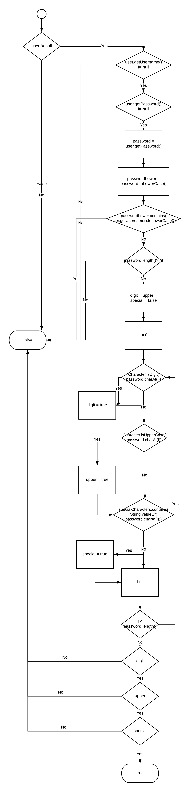

# Софтверско Инженерство Лаб. 2
### Група на код:
Ја добив групата на код 4
### Control Flow Graph

### Цикломатска комплексност
Цикломатската комплексност на овој код е 13. Формулата е P+1, каде што P е бројот на предикатни јазли. Во случајoв P=12, па цикломатската комплексност изнесува 13.
